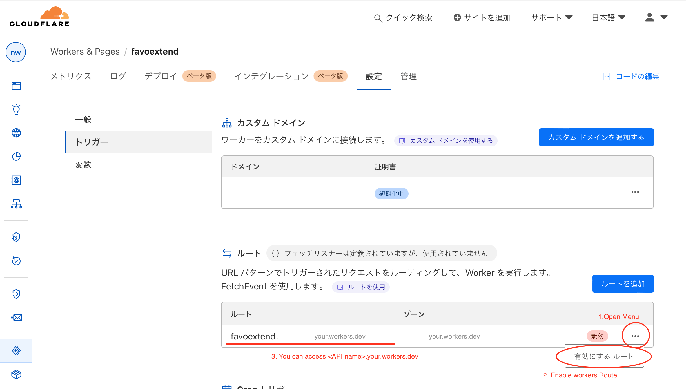

# favoExtend

This is backend-builder of Website favorite(like) and develop extend feature.

## Setup

### Register service

Create Accounts and publish tokens

- Upstash
  - Create API Key from [Management API](https://console.upstash.com/account/api)
- Cloudflare
  - Create API Token from [User API Token](https://dash.cloudflare.com/profile/api-tokens)
    - _NOT API Key_
  - Set allocation of...
    - Account-Workers Script-Edit
    - Zone-Workers Route-Edit (Only if you use workers route)

### Install terraform

Install terraform CLI. Reference is [here](https://developer.hashicorp.com/terraform/tutorials/aws-get-started/install-cli).

### Manage tfstate configuration

This product use R2 storage as tfstate backend.

#### If you use R2 backend, setup terraform.tfbackend

If you use save tfstate on Cloudflare R2, you need to get R2 Access key, Access secret and endpoint url from `https://dash.cloudflare.com/<CLOUDFLARE_ACCOUNT_ID>/r2/api-tokens`

After you got Access key, Access secret and endpoint url, edit `terraform.tfbackend` from `terraform.tfbackend.template`

If you manage tfstate on local, you don't need to setup `terraform.tfbackend`.

#### No need to tfstate or only try, reduce provider.tf

If you don't need to manage tfstate on Cloudflare R2, edit `provider.tf`, remove `backend "s3"` block or delete `provider.tf`.

```diff
terraform {
-   backend "s3" {
-     bucket                      = "tfstate"
-     key                         = "extendfavorite.tfstate"
-    region                      = "auto"
-     skip_credentials_validation = true
-     skip_region_validation      = true
-     skip_requesting_account_id  = true
-     skip_metadata_api_check     = true
-     skip_s3_checksum            = true
-   }
}
```

### Prepair terraform.tfvars

Prepair `terraform.tfvars` file from `terraform.tfvars.template`

#### !Attention

**For LAZINESS or ANNOY of Cloudflare Developper team**, workers route of `workers.dev` zone cannot enable with terraform deploy.

3 Issue about this problem but it closed with any resolve.

[Enable the default route for cloudflare workers #2892](https://github.com/cloudflare/terraform-provider-cloudflare/issues/2892) (Closed with NO support)

[Support Worker Domains #1921](https://github.com/cloudflare/terraform-provider-cloudflare/issues/2892) (Closed with NO support)

[Support for Workers.dev route #1013](https://github.com/cloudflare/terraform-provider-cloudflare/issues/1013) (Closed with NO support)

So `favoExtend` only support workers route of domains you managed in cloudflare domain.

If you wanna use `workers.dev`, manually setup by dashboard.



### Deploy extendfavorite

Initialize environment

```sh
terraform init -backend-config terraform.tfbackend
```

Plan deploy

```sh
terraform plan
```

Deploy

```sh
terraform apply
```

Destroy

```sh
terraform destroy
```

## Extend API

If you need to Extend API, see [Extend Guide(README.md)](/api/src/README.md).

## Reference

[Install Terraform | Terraform | HashiCorp Developer](https://developer.hashicorp.com/terraform/tutorials/aws-get-started/install-cli)    
[Support Cloudflare r2 for storing Terraform state #33847](https://github.com/hashicorp/terraform/issues/33847#issuecomment-1854605813)  
[Japanese Reference(Zenn/favoExtend マニュアル)](https://zenn.dev/nkte8/books/favoextend-manual)  
